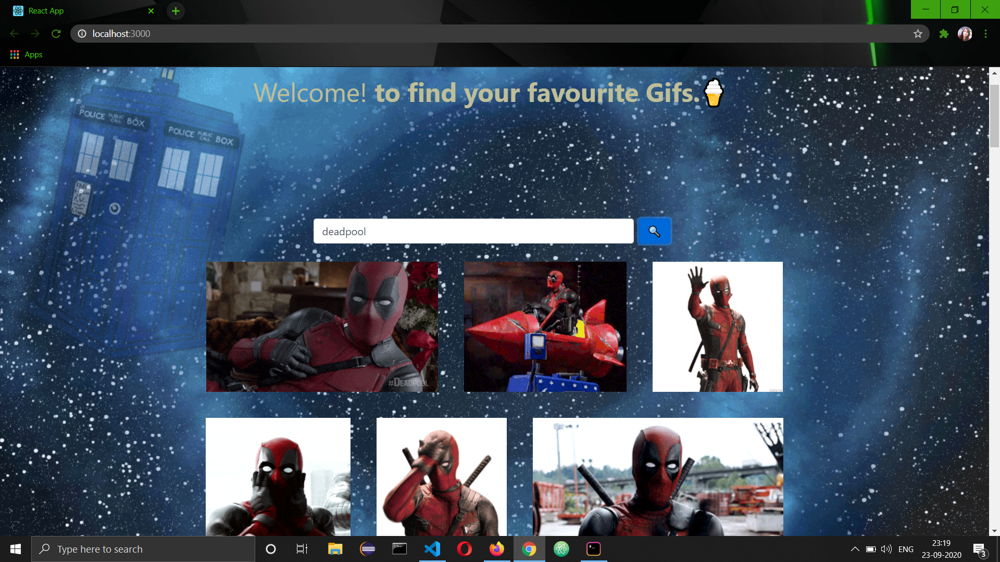

# GooFy-React
## A website that make sure you find all your favourite gifs.🍕
# Screenshots.

## Instructions
1) Clone this repo to your local machine.
2) Create an account on giphy from https://giphy.com/ 
3) Get an API key from https://developers.giphy.com/dashboard/ by creating an App and select the API.
4) Replace the above API key with GIPHY_KEY in src/components/Giphy.jsx file.
5) Using bash or Hyper terminal install the below packages
### `npm start` to start the development server
## Requirement
Node js

## packages
1) npm install --save react-typical
2) Having an error? ('react-scripts' is not recognized as an internal or external command,operable program or batch file.) 
 - npm install react-scripts
